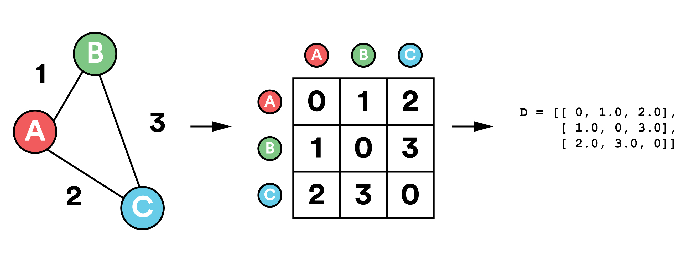

Suboptimal Travelling Salesman Problem (TSP) solver
===================================================
In pure Python.

This project provides a pure Python code for searching sub-optimal solutions to the TSP.
Additionally, demonstration scripts for visualization of results are provided.


The library does not requires any libraries, but demo scripts require:
- Numpy
- PIL (Python imaging library)
- Matplotlib

### Modules provided:
- **tsp_solver.greedy** : Basic greedy TSP solver in Python
- **tsp_solver.greedy_numpy** : Version that uses Numpy matrices, which reduces memory use, but performance is several percents lower
- **tsp_solver.demo** : Code for the demo applicaiton

### Scripts provided

- **demo_tsp** : Generates random TSP, solves it and visualises the result. Optionally, result can be saved to the numpy-format file.
- **tsp_numpy2svg** : Generates neat SVG image from the numpy file, generated by the **demo_tsp**.

Both applications support a viriety of command-line keys, run them with --help option to see additional info.

 
Installation
------------
Standard distutils-based installer is provided. Run the following code to install the library:

```sh
 # python setup.py install
```

Note that in Linux, this will bypass the package management system. Consider using dedicated tools, such as checkinstall.

Alternatively, you may simply copy the tsp_solver/greedy.py to your project.

Usage
-----
The library provides a greedy solver for the symmetric TSP.

Basic usage is the following:

```python
from tsp_solver.greedy import solve_tsp

#Prepare the square symmetric distance matrix for 3 nodes:
#  Distance from A to B is 1.0
#                B to C is 3.0
#                A to C is 2.0
D = [[ 0, 1.0, 2.0],
     [ 1.0, 0, 3.0],
     [ 2.0, 3.0, 0]]

path = solve_tsp( D )

# will print [1,0,2], path with total length of 3.0 units
print path
```

The matrix `D` in the above example represents the following graph with three nodes A, B, and C:




Distance matrix must be symmetric.

Algorithm
---------

The library implements simple "greedy" algorithm: 
1. Initially, each vertex belongs to its own path. Each path has length 1.
2. Find 2 nearest disconnected paths and connect them.
3. Repeat, until there are at leats 2 paths.

This algorightm has polynomial complexity.

### Optimization
Greedy algorithm sometimes produces highly non-optimal solutions. To solve this, **optimization** is provided. It tries to rearrange points in the paths to improve the solution. One optimization pass has O(n^4) complexity. Note that even unlimited number of optimization paths does not guarantees to find the optimal solution.


Performance
-----------

This library neither implements a state-of-the-art algorithm, nor it is tuned for a high performance. 

It however can find a decent suboptimal solution for the TSP with 4000 points in several minutes. The biggest practical limitation is memory: O(n^2) memory is used.

Demo
----

To see a demonstration, run 
```sh
$ make demo
```
without installation. The demo requires **Numpy** and **Matplotlib** python libraries to be installed.